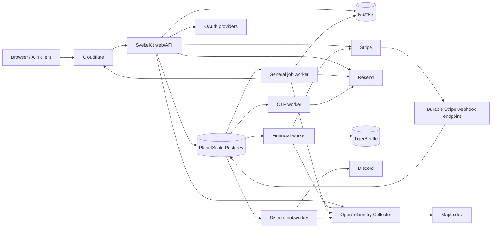

# 02 — Technical architecture

## 1. Architecture style

Use a **modular monolith with explicit workers**, not microservices.

The payment, membership and content domains live in one TypeScript codebase with hard package boundaries. Runtime separation exists where failure modes differ: HTTP, financial worker, general jobs, OTP delivery and Discord bot.



## 2. Repository layout

```text
apps/
  web/                 SvelteKit SSR, pages and HTTP API
  worker/              outbox, email, media, analytics and domains
  finance-worker/      Stripe event normalisation, ledger and reconciliation
  discord-bot/         Discord gateway and role reconciliation
packages/
  auth/                Better Auth configuration and permission checks
  db/                  Kysely schema, migrations and repositories
  domain/              pure domain types, policies and state machines
  ledger/              TigerBeetle adapter and posting definitions
  payments/            Stripe client, Connect and checkout orchestration
  storage/             S3/RustFS abstraction
  email/               Resend templates and delivery handling
  api-contracts/       OpenAPI types, webhook schemas and errors
  ui/                  Svelte components and StyleX recipes
  design-tokens/       generated Paperlight variables
  observability/       OTel helpers, redaction and span conventions
infra/
  coolify/
  docker/
  otel/
  backups/
  runbooks/
```

Use pnpm workspaces and a single lockfile. Pin the current LTS Node runtime and all Stripe/TigerBeetle API versions in source control.

## 3. Application stack

- SvelteKit with `adapter-node` behind Coolify’s reverse proxy.
- Better Auth with SvelteKit cookie integration, email OTP, passkeys, organisations, generic OAuth and social providers.
- StyleX through the official SvelteKit/Vite unplugin integration.
- Kysely plus `pg` for explicit SQL and predictable performance.
- Zod or TypeBox at every external boundary; domain types remain independent from validation library types.
- OpenAPI generated from the shared API contracts.
- Markdown AST storage/rendering with an allowlisted embed transform and HTML sanitiser.

## 4. Runtime processes

### Web/API

- SSR public/project pages.
- Authentication callbacks and sessions.
- Checkout-session creation.
- Project/supporter/admin dashboards.
- Public API and incoming outgoing-webhook management.
- Direct uploads via presigned RustFS URLs.

Scale vertically first. Run at least two web process instances behind the local reverse proxy so a process restart does not drop every request, while recognising both instances still share one host.

### Financial worker

Only process allowed to post TigerBeetle transfers.

- Consumes durable Stripe events from PostgreSQL.
- Normalises provider objects.
- Creates ledger posting intents.
- Posts deterministic TigerBeetle accounts/transfers.
- Materialises read models.
- Grants/revokes entitlements after verified payment state.
- Runs daily Stripe reconciliation.

### General worker

- Resend delivery.
- Image variants and malware/content checks.
- post scheduling.
- webhooks.
- analytics rollups.
- custom-domain provisioning/polling.
- cleanup and retention jobs.

The production OTP worker runs the same worker binary with `WORKER_QUEUE=otp`.
It claims only the `otp` queue and does not process outbox or webhook work first, so
authentication mail is not delayed by general work. General workers ignore
`otp`; both workers retain the same PostgreSQL lease, heartbeat and recovery
semantics.

### Discord bot

- Gateway connection isolated from HTTP restarts. Enable Discord's **Server Members Intent** (`GUILD_MEMBERS`) for the bot application; the bot requests only `GUILDS | GUILD_MEMBERS` gateway intents.
- `GUILD_MEMBER_ADD` and `GUILD_MEMBER_UPDATE` events enqueue ID-only role jobs for linked supporters, keeping rejoin/grant latency event-driven without polling every guild member.
- Role grant/revoke commands from PostgreSQL jobs.
- Periodic desired-state reconciliation remains the recovery path for missed events.
- One active process at launch, protected by a database lease.

## 5. PostgreSQL: PlanetScale PS-5 assessment

The selected London **PS-5 HA** configuration is appropriate for beta:

- Three nodes across availability zones.
- 1/16 vCPU and 512 MB memory per database node.
- 10 GB initial network-attached storage.
- Baseline 3,000 IOPS and 125 MiB/s throughput on AWS network storage.
- 100 GB monthly public egress for production branches.

The workload target averages one successful transaction roughly every four minutes. Even allowing large traffic spikes, the database is more likely to be constrained by poor queries or excessive connections than by transaction volume.

### Connection policy

- Use the included local PgBouncer endpoint on port `6432` in transaction-pooling mode.
- Web pool: maximum 8 connections across all web instances initially.
- General worker: maximum 3.
- Finance worker: maximum 3.
- Discord bot: maximum 2.
- Migrations/admin tasks: direct port `5432`, one connection, never from request handling.
- Do not use session advisory locks, session variables, temporary tables or named prepared statements that assume session affinity.
- Use row locks and `FOR UPDATE SKIP LOCKED`; if advisory locking is required, use transaction-scoped locks only.
- Email delivery keeps its transaction-scoped recipient lock through provider I/O and reconciliation; this pins one database connection per active send and bounds concurrency by the worker pool size. Split claim/send only with an idempotent outbox protocol.
- Retry serialisation errors and failover disconnects with bounded exponential backoff and jitter.

### Upgrade triggers

Move to PS-10 HA when any trigger persists for a week or affects p95 latency:

- CPU above 60% for sustained busy windows.
- Memory pressure/cache misses causing repeated disk reads.
- p95 simple indexed query above 20 ms from the application region.
- Connection wait above 25 ms.
- More than 7 GB active storage or rapid event-log growth.
- Autovacuum cannot keep up with event/queue tables.

100 GB egress is ample: at 10,000 transactions a month, even an implausible 1 MB of database response data per transaction is only 10 GB. Public media must never be served through PostgreSQL.

A paid dedicated PgBouncer is not required for beta. The application must reconnect/retry during failover. Add a dedicated primary PgBouncer only if failover error windows become material.

## 6. TigerBeetle deployment

TigerBeetle is included from day one as required.

### Development

- One Docker container.
- One formatted development replica.
- Data volume on local filesystem.
- Deterministic seed fixtures and a disposable cluster script.

### Production beta

- One local replica on the dedicated server, using a dedicated NVMe-backed bind mount.
- Allocate at least 6 GiB of memory to TigerBeetle if the host permits.
- Bind only to the private Docker network/loopback; TigerBeetle has no built-in user permission system.
- Supervisor restart policy and process/lag/disk alerts.
- Never place the data file on overlay storage or an ephemeral container layer.

This is **not** a production HA TigerBeetle cluster. TigerBeetle recommends six replicas on separate machines for production. Until that exists:

- PlanetScale stores an immutable ledger posting-intent journal before each TigerBeetle write.
- Transfer/account IDs are deterministic.
- A fresh TigerBeetle cluster can be rebuilt by replaying intents.
- Stripe and the connected-account data remain the external payment source of truth.
- Checkout/webhook receipt remains available during TigerBeetle downtime; financial finalisation and entitlement changes queue until ledger recovery, with a visible degraded state.

This makes the single replica an operational system of record for balances but not an unrecoverable single copy.

## 7. RustFS object storage

Buckets:

```text
oss-public-media       project logos, banners and public post images
oss-private-content    gated attachments
oss-quarantine         unscanned uploads
oss-exports            temporary project exports
oss-backups            optional encrypted local staging only
```

Rules:

- Browser uploads directly with short-lived presigned PUT URLs.
- Object key is server generated; never trust user filename as path.
- Upload completes into quarantine, then the server validates MIME by content, sends PDF/plain-text attachments through the configured ClamAV daemon, decodes images, strips metadata and moves safe bytes to the final bucket. Scanner errors fail closed.
- Public objects are immutable and content-addressed; replace creates a new object key.
- Private objects are never public-bucket objects and require short-lived signed GET URLs after entitlement checks.
- Store object metadata and ownership in PostgreSQL.
- Use the common S3 subset only; RustFS documents a tested subset rather than perfect S3 compatibility.
- Nightly inventory verifies PostgreSQL references against objects.
- Nightly maintenance reclaims stale unreferenced content-addressed final/export objects and quarantine uploads after the recovery window, with locked PostgreSQL reference checks.

## 8. Cloudflare edge and caching

### Public pages

- Cloudflare fronts `oss.tips`, media and custom domains.
- Cache project pages and public posts for 60 seconds with 10-minute stale-while-revalidate.
- Cache key includes canonical host, path and locale; never cookies.
- Dashboard, auth, support composer, checkout, private content and API mutations are bypassed.
- Purge changed project/post URLs through the Cloudflare API from the outbox worker.
- Immutable media uses one-year cache headers and content-hashed URLs.

### Custom domains

Use Cloudflare for SaaS:

- Default target such as `domains.oss.tips`.
- Verify project is in 5% mode before provisioning.
- Project proves control through the required CNAME/TXT flow.
- Cloudflare issues and renews TLS.
- Public routes only; support actions redirect to canonical `oss.tips/<project>/support`.
- One custom hostname per project in beta.
- Remove/disable hostname if project leaves 5% mode after a 30-day grace period.

Cloudflare currently includes 100 custom hostnames on non-enterprise plans and charges per additional hostname, so this should remain nearly free at beta scale.

## 9. Resend

- Use Resend for email OTP, verification, payment notices, project replies, security alerts and operational mail.
- Send from the Ireland region for latency.
- Resend stores account metadata/logs in the US even when mail is sent from Ireland; this is covered by the narrowed data-residency policy and processor documentation rather than described as EU-only storage.
- Avoid placing private post bodies or unnecessary payment details in email.
- Receive `/api/webhooks/resend` with Resend/Svix raw-body verification and a five-minute timestamp window.
- Process delivered, bounced and complained webhooks into the email-delivery table.
- Suppress repeated delivery to hard bounces/complaints.
- OTP mail uses the highest-priority queue and has a separate rate limit.

## 10. Observability with Maple

Every runtime emits OTLP to an on-host OpenTelemetry Collector.

Collector responsibilities:

- Remove `authorization`, cookies, Stripe signatures, OAuth codes and all request/response bodies.
- Drop query strings on custom-domain routes.
- Hash account/project IDs with a rotating telemetry key when identity is not necessary.
- Never export email, supporter message, payment amount plus identity, repository tokens or object signed URLs.
- Sample successful public-page traces; retain 100% of payment, webhook and error traces.
- Export metrics, logs and traces to Maple.

Core service-level telemetry:

- HTTP latency/error rate by route template.
- Stripe webhook receipt-to-processed latency.
- Ledger posting queue age and failures.
- Stripe/TigerBeetle reconciliation differences.
- Entitlement/Discord role latency.
- Postgres pool usage and query duration.
- RustFS operation errors and quota.
- Resend bounce/complaint rate.
- Cloudflare domain state and certificate failures.

## 11. Queue and outbox design

No Redis or Kafka in beta.

PostgreSQL tables:

- `job` with type, payload reference, priority, attempts, available_at, lease owner/expiry.
- `outbox_event` written in the same transaction as domain changes.
- `stripe_event` append-only incoming inbox.
- `webhook_delivery` for project webhooks.

Workers claim with `FOR UPDATE SKIP LOCKED`, commit a lease, execute idempotently and mark complete. Long external operations renew leases. Dead-letter after a policy-specific attempt count and alert.

## 12. Performance budgets

| Surface                                        |                    Budget |
| ---------------------------------------------- | ------------------------: |
| Cached public page TTFB p75                    |            < 150 ms UK/EU |
| Uncached SSR TTFB p95                          |                  < 500 ms |
| Dashboard API p95                              |                  < 400 ms |
| Checkout-session creation p95 excluding Stripe |                  < 300 ms |
| Stripe event receipt                           | durable response < 500 ms |
| Payment event to dashboard/ledger p95          |                    < 30 s |
| Entitlement/Discord p95                        |                    < 60 s |
| Initial public JS                              |       < 170 kB compressed |
| Dashboard initial JS                           |       < 320 kB compressed |
| Public LCP p75                                 |                   < 2.0 s |

Use route-level code splitting, server rendering, progressive enhancement and minimal client state. Charts load only on dashboard analytics routes.

## 13. Failure behaviour

- PlanetScale unavailable: public cached pages continue; mutations fail closed with a status message.
- Stripe unavailable: browsing works; checkout disabled/retried; never queue a guessed payment.
- TigerBeetle unavailable: receive/store Stripe events, pause financial finalisation and show “processing”; replay after recovery.
- RustFS unavailable: text pages remain; uploads/attachments unavailable.
- Discord unavailable: payment succeeds and entitlement exists; role job retries.
- Resend unavailable: OAuth/passkeys remain usable; OTP requests show delayed delivery and retry; do not reveal whether an email is registered.
- Maple unavailable: collector buffers briefly/drops according to policy; production requests never block on telemetry.
