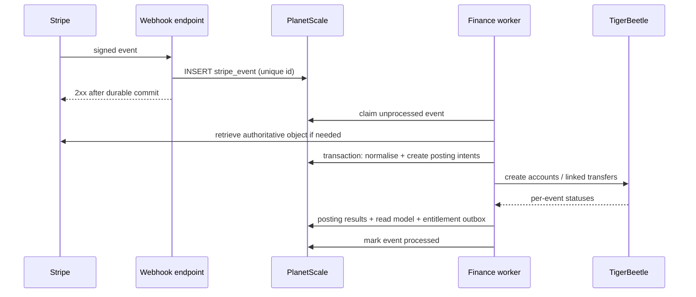

# 03 — Data model and TigerBeetle ledger

## 1. Data ownership split

### PostgreSQL owns

Identity, projects, permissions, content, provider object metadata, webhooks, jobs, audit records, entitlement state, analytics read models and the durable ledger posting-intent journal.

### TigerBeetle owns

Immutable monetary accounts, transfers and computed balances by ledger/currency.

### Stripe owns

Payment method data, connected-account KYC/payout configuration, authoritative charge/refund/dispute objects and provider balance transactions.

### RustFS owns

Object bytes only. PostgreSQL owns object purpose, visibility, project, quota and lifecycle.

## 2. PostgreSQL schema groups

### Authentication

```text
user
session
account                         Better Auth provider account
verification                    OTP/passkey verification state
passkey
user_security_event
```

### Organisations and projects

```text
organisation
organisation_member
project
project_member
project_repository
project_claim
project_contact
project_feature_mode            standard or contributes_5_percent
project_review
project_status_history
```

### Stripe/payment domain

```text
stripe_connected_account
stripe_capability_snapshot
stripe_customer_binding         one supporter/project connected account
stripe_product_binding
stripe_price_binding
stripe_event                     append-only, unique provider event id
payment                          one-off or invoice payment
payment_allocation               project amount / project fee / supporter tip
refund
payment_dispute
subscription
subscription_period
provider_balance_transaction
reconciliation_run
reconciliation_difference
```

### Membership/content

```text
tier
tier_price
tier_reward
entitlement
post
post_revision
post_visibility_rule
post_attachment
supporter_public_profile
supporter_message_thread
supporter_message
project_goal
```

### Integrations

```text
discord_connection
discord_guild
discord_role_mapping
discord_role_assignment
api_key
webhook_endpoint
webhook_delivery
custom_domain
email_delivery
object_asset
```

### Platform operations

```text
audit_event
admin_case
abuse_report
job
outbox_event
ledger_account_binding
ledger_posting_intent
ledger_posting_result
metric_event_hourly
project_metric_daily
platform_metric_daily
```

## 3. Identifier policy

- Public objects use UUIDv7 or ULID-style sortable IDs.
- Database primary keys are UUIDv7; human slugs are separate and mutable with redirect history.
- Stripe IDs are never primary keys; store provider, account scope and object ID with a unique constraint.
- TigerBeetle account/transfer IDs are unsigned 128-bit values derived from a namespaced cryptographic hash.

Example deterministic ID input:

```text
oss.tips/v1/transfer/{stripe_account_id}/{stripe_event_id}/{posting_kind}/{posting_version}
```

Take the first 128 bits of BLAKE3/SHA-256, map forbidden zero/max values, and persist the source tuple in PostgreSQL. Changing posting semantics increments `posting_version` rather than reusing an ID.

## 4. Currency and integer policy

- Every amount is integer minor units.
- Never store money in floating point.
- Store ISO 4217 currency and exponent snapshot where needed.
- TigerBeetle uses one ledger number per currency, generated from a checked static registry.
- Cross-currency display conversions are analytics metadata, never balancing transfers in the original-currency ledger.
- Stripe Adaptive Pricing conversion details are stored from the provider object for reporting.

## 5. TigerBeetle account model

Account code registry:

| Code | Account class | Scope |
|---:|---|---|
| 100 | Stripe external clearing | connected account + currency |
| 110 | Payment transit | payment + currency |
| 200 | Project gross support | project + currency |
| 210 | Project estimated Stripe fee expense | project + currency |
| 220 | Project refund/dispute loss | project + currency |
| 300 | oss.tips project-fee revenue | platform + currency |
| 310 | oss.tips supporter-tip revenue | platform + currency |
| 320 | oss.tips fee-refund contra revenue | platform + currency |
| 400 | Unreconciled/suspense | provider account + currency |

A per-payment transit account makes the split explicit and allows exact reversal without mutating history. TigerBeetle scale is not a concern at the expected volume.

Account metadata that does not fit TigerBeetle remains in `ledger_account_binding`.

## 6. Transfer codes

| Code | Meaning |
|---:|---|
| 1000 | settled customer payment into transit |
| 1010 | transit to project gross share |
| 1020 | transit to oss.tips project fee |
| 1030 | transit to oss.tips supporter tip |
| 1040 | Stripe processing fee attribution |
| 1100 | full/partial project refund |
| 1110 | application-fee refund |
| 1120 | dispute opened |
| 1130 | dispute won/reversal |
| 1140 | dispute lost/final |
| 1200 | manual correction |
| 1300 | reconciliation suspense transfer |

Posting chains for one provider event use TigerBeetle linked transfers so either the complete split is accepted or none is.

## 7. One-off settlement example

Project amount `P = 1000`, project fee rate `2%` is not applicable to one-off standard mode, supporter tip `T = 100`.

```text
Stripe clearing -> payment transit     1100
payment transit -> project gross       1000
payment transit -> platform tip         100
```

For a project in 5% mode:

```text
Stripe clearing -> payment transit     1100
payment transit -> project gross        950
payment transit -> platform fee          50
payment transit -> platform tip         100
```

When Stripe balance-transaction fee data arrives, record the project-attributed processing fee separately. It is reporting information rather than a deduction performed by oss.tips.

## 8. Subscription invoice posting

Each paid invoice is a distinct payment and posting chain. The subscription record defines entitlement continuity but does not carry a mutable “lifetime paid” balance.

At `invoice.created`, calculate the exact application fee in minor units from stored membership amount, fee mode and supporter tip and set `application_fee_amount` on the connected-account invoice before finalisation. This avoids the two-decimal precision limitation of a recurring percentage and preserves exact splits.

Only `invoice.paid`/verified succeeded state posts settlement and advances entitlement. `invoice.payment_failed` starts/continues grace but posts no money.

## 9. Delayed payment methods

- Create a pending payment record when Checkout completes with a processing state.
- Do not post a settled transfer or grant entitlement until the provider reports final success.
- Optionally use TigerBeetle pending transfers only when the provider amount is irrevocably reserved; otherwise keep pending state in PostgreSQL to avoid representing funds that Stripe has not confirmed.

## 10. Refunds and disputes

Never update or delete original ledger transfers.

### Refund

- Create new reverse-direction transfers referencing the original payment allocation.
- Refund platform project fee proportionally/full according to provider refund.
- Refund supporter tip proportionally with the payment unless Stripe/provider rules require a separate explicit choice; v1 policy refunds it proportionally.
- Recompute entitlement from net settled amount and policy.

### Dispute

- Record dispute open as a separate loss/suspense movement.
- On win, reverse it.
- On final loss, move from suspense to project dispute loss.
- Pause project payments automatically on configurable dispute-rate/risk thresholds, but never invent a platform-held reserve.

## 11. Posting pipeline



The webhook endpoint performs signature verification, size limit and durable insert only. No Stripe retrieval, TigerBeetle write, email or Discord call occurs before returning 2xx.

## 12. Idempotency

Layers:

1. Unique Stripe event ID in `stripe_event`.
2. Unique provider object/state version for normalised transitions.
3. Unique `ledger_posting_intent` semantic key.
4. Deterministic TigerBeetle transfer ID.
5. Unique entitlement transition key.
6. Unique outgoing webhook event ID.

A duplicate at any layer returns the already-created result. Retrying after a transient TigerBeetle validation failure uses a new deterministic attempt ID only when TigerBeetle requires it; the semantic posting intent remains the same and records the mapping.

## 13. Reconciliation

### Near-real-time

After processing a settled Stripe object:

- Sum payment allocations equals charge amount.
- TigerBeetle transit account balances to zero.
- Application fee in Stripe equals the intended platform fee/tip within currency rounding.
- Read-model payment totals equal ledger postings.

### Daily provider reconciliation

For every connected account/currency/day:

- Fetch Stripe balance transactions and charges/invoices/refunds/disputes.
- Compare provider gross, application fees, refunds and fees against normalised PostgreSQL and TigerBeetle postings.
- Classify differences as timing, missing event, unknown provider object, wrong amount or ledger failure.
- Auto-retrieve/reprocess missing events.
- Anything unresolved after the timing window creates an admin alert.

### Platform balance reconciliation

Reconcile oss.tips Stripe platform application-fee balance against sum of platform fee/tip TigerBeetle accounts and Stripe application-fee refunds.

## 14. Recovery of the beta single-replica ledger

1. Stop financial posting; continue durable Stripe event receipt.
2. Preserve/copy the TigerBeetle data file if readable.
3. Create a fresh cluster/data file with a new cluster ID.
4. Replay account definitions and ordered `ledger_posting_intent` rows.
5. Compare all account balances and posting counts to PostgreSQL expectations and Stripe reconciliation.
6. Switch worker configuration only after verification.
7. Drain new queued events.

A tested replay tool is a launch requirement, not a future enhancement.

## 15. Read models

Dashboards query PostgreSQL, never fan out to Stripe/TigerBeetle per page.

Materialised tables/views:

- Project day/currency totals.
- Active membership counts and MRR.
- Supporter lifetime totals.
- Platform application-fee/tip revenue.
- Goal progress.
- Payment timeline.
- Reconciliation health.

Workers update the current day incrementally and rebuild any day from immutable payment/ledger inputs. Nightly consistency jobs compare rollups to source rows.

## 16. Retention

- Financial/audit/provider event records: retain for the legally/accountingly required period; default seven years pending professional confirmation.
- OTP and transient verification: minutes/hours according to policy.
- Raw security IP logs: short retention, initially 30 days.
- Analytics raw events: 90 days; daily aggregates longer.
- Webhook bodies: retain redacted/minimised form; provider event IDs and hashes permanently with financial record.
- Expired export files: 24 hours.
- Deleted public media: soft-delete metadata then purge object after recovery window unless legal hold applies.
